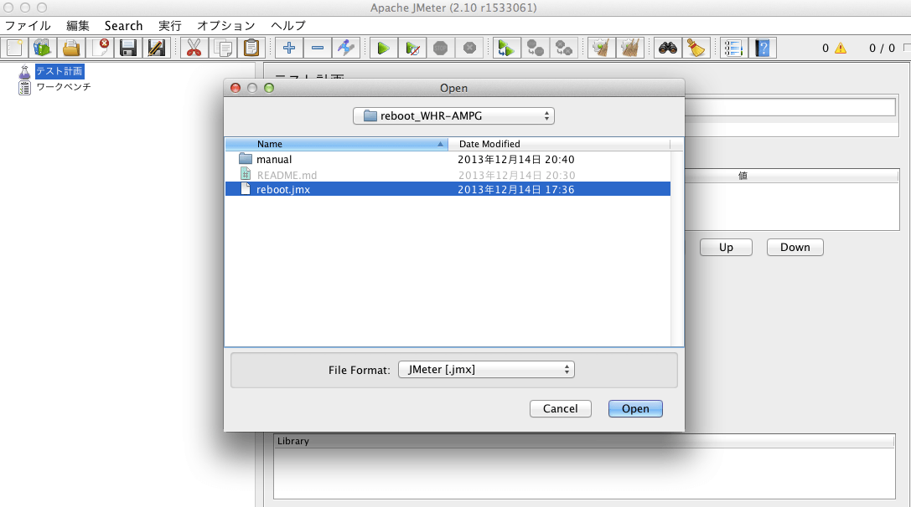
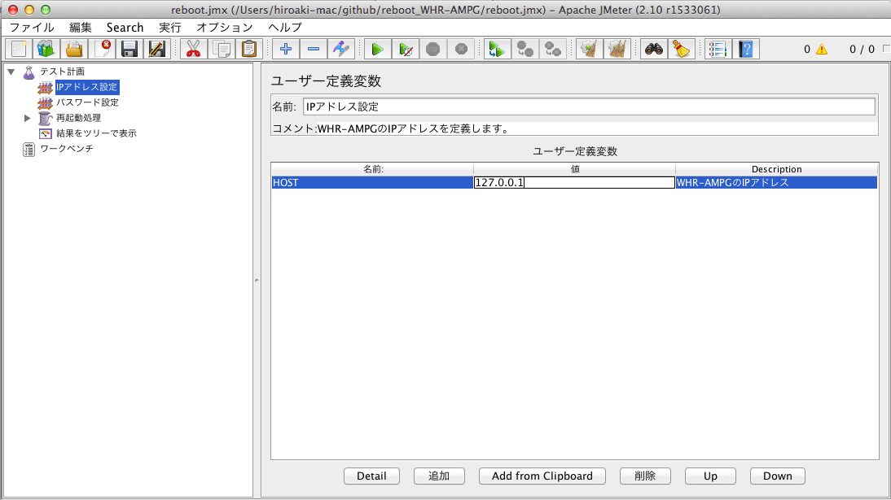
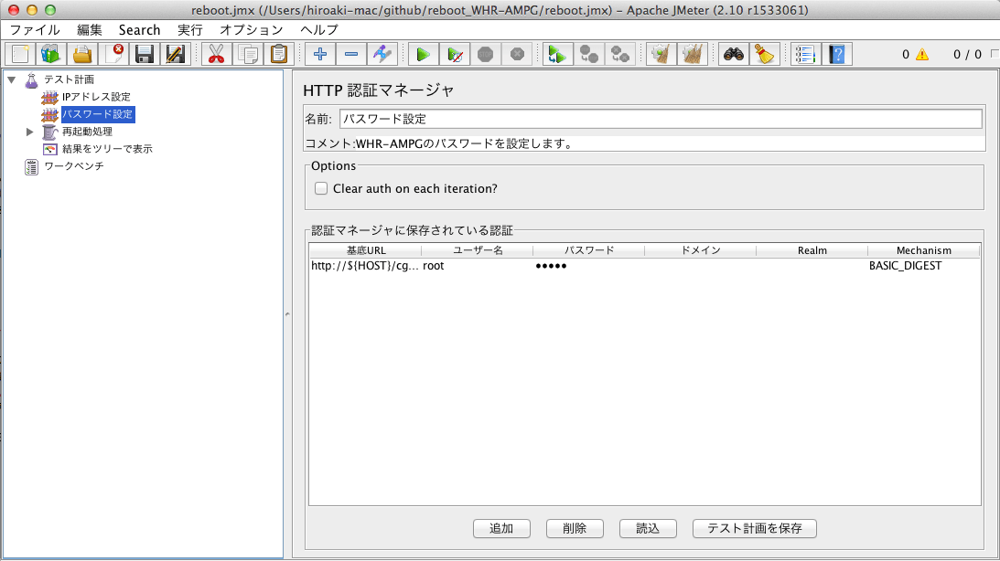
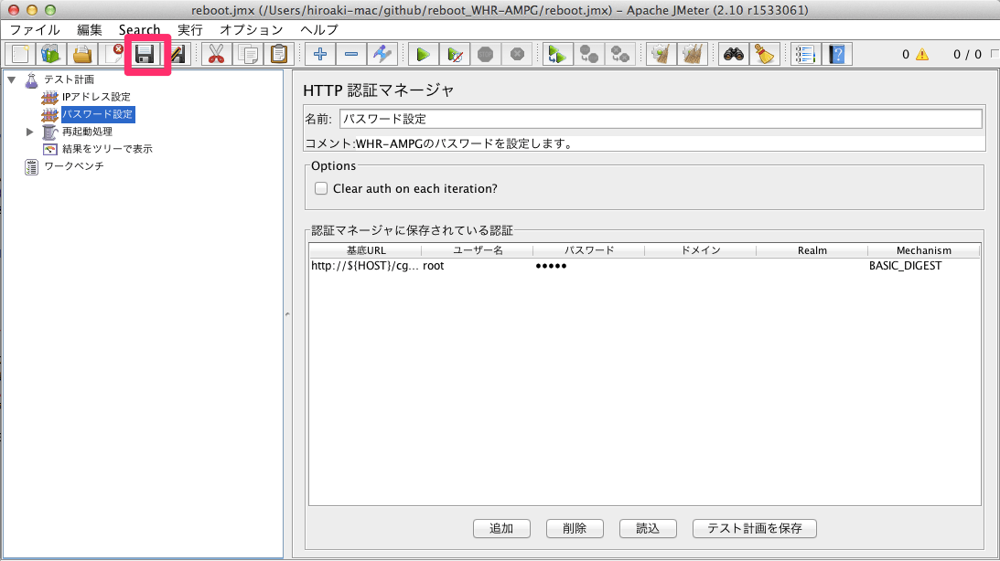
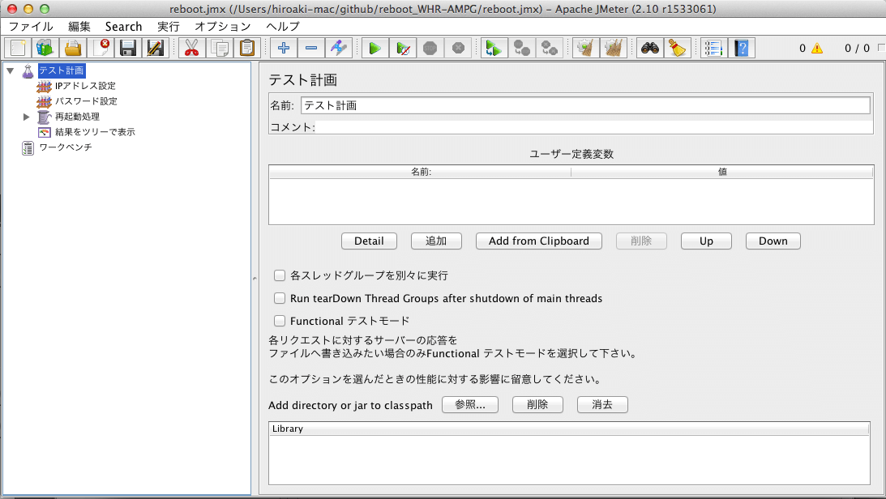
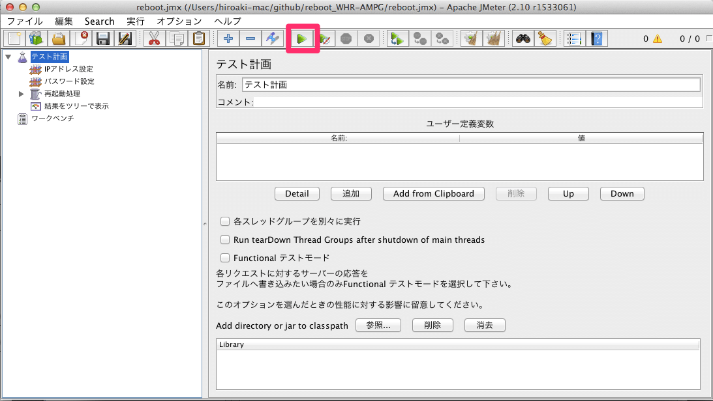

# 初期設定
## 前提ソフトウェア
本scriptは[JMeter](http://jmeter.apache.org/)のscriptですので、JMeterが必要です。また、JMeterを動作させるには、[Java](http://java.com/)が必要です。必要なバージョンについては、JMeterのサイトで確認してください。
## 初期設定
使用する前に、WHR-AMPGのIPアドレスとログインパスワードを設定する必要があります。

JMeterを起動したら、ファイルメニュー→開く でreboot.jmxを開いてください。

左側のペインから「IPアドレス設定」を選択して、右側の「127.0.0.1」とある欄をクリックします。

WHR-AMPGのIPアドレスを入力します。

次に、左側のペインから「パスワード設定」を選択します。

右側の「パスワード」の欄をクリックして、WHR-AMPGのパスワードを入力します。

入力が終わったら、Saveボタンを押してreboot.jmxを上書き保存します。

WHR-AMPGのパスワードを変更したり、IPアドレスを変更したりした場合、この初期設定をやり直してください。

## 使い方
JMeterを起動し、ファイルメニュー→開く でreboot.jmxを開いてください。

実行ボタンを押します。設定されているIPアドレスのWHR-AMPGを再起動させます。

再起動しない場合、他のユーザがWHR-AMPGにログインしていないかを確認してください。また、設定したIPアドレスやパスワードを確認してください。

## 便利な使い方
JMeterは画面なしで動かすことができるので、cronやタスクスケジューラに登録して定期的に動かすのがよいでしょう。

jmeter -n -t reboot.jmx

